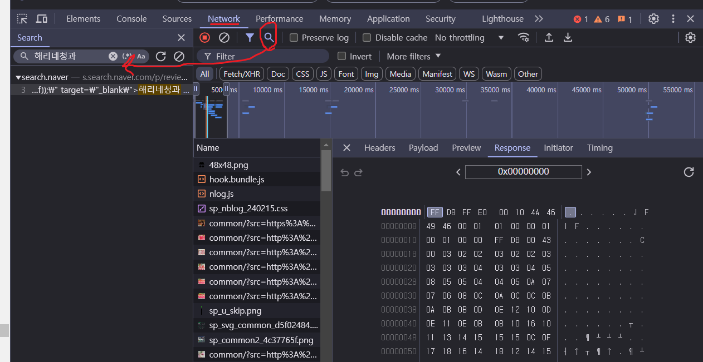

# 무한스크롤데이터

> 스크롤하면 나오는 추가데이터를 해당 서버에 요청하면됌 (네이버면 네이버서버에 요청)

- f12 네트워크탭에서 스크롤시 추가되는 데이터파일들 속에서, 실제 출력된 파일리스트를 찾아내고 서버에 따로 요청하면 됌
  - 이미지 참고해서 검색하면 무한스크롤로 추가된 데이터들 속에서 해당 데이터 쉽게 찾을수있음



- 해당 데이터의 `headers`탭에 Request URL 경로로 GET요청을하면 됌

```python
import requests
from bs4 import BeautifulSoup

# 해당 데이터를 가져오고
data= requests.get('https://s.search.naver.com/p/review/48/search.naver?ssc=tab.blog.all&api_type=8&query=사과&start=31&ac=1&aq=0&spq=0&sm=tab_jum&nso=&prank=31&ngn_country=KR&lgl_rcode=09215101&fgn_region=&fgn_city=&lgl_lat=37.560675&lgl_long=127.080038')

# class='\' 껴있는거를 ''로 바꿔주고
soup = BeautifulSoup(data.text.replace('\\',''), 'html.parser')

# 해당 a태그의 class 명 가져오고 (참고로 [] 리스트형식으로 가져옴)
글리스트 =  soup.select('a.title_link')

#출력
print(글리스트[0].text) #겨울홈카페 레시피 사과 계피차 감기에 좋은 차 애플티
print(글리스트[1]['href']) #https://blog.naver.com/puffy38/223686005355
print(글리스트[2].text)
```

- 무한스크롤 크롤링은 url의 query문을 유심히 봐서 잘 하면됌

```python
import requests
from bs4 import BeautifulSoup

# 해당 데이터를 가져오고 start=1~31 가져오고
data= requests.get('https://s.search.naver.com/p/review/48/search.naver?ssc=tab.blog.all&api_type=8&query=사과&start=31&ac=1&aq=0&spq=0&sm=tab_jum&nso=&prank=31&ngn_country=KR&lgl_rcode=09215101&fgn_region=&fgn_city=&lgl_lat=37.560675&lgl_long=127.080038')

# start=31~61 가져오고
data= requests.get('https://s.search.naver.com/p/review/48/search.naver?ssc=tab.blog.all&api_type=8&query=사과&start=61&ac=1&aq=0&spq=0&sm=tab_jum&nso=&prank=31&ngn_country=KR&lgl_rcode=09215101&fgn_region=&fgn_city=&lgl_lat=37.560675&lgl_long=127.080038')
```

TODO: <br/>

1. for문으로 바꾸기
2. def 네이버블로그순위(): 함수같은거만들기
