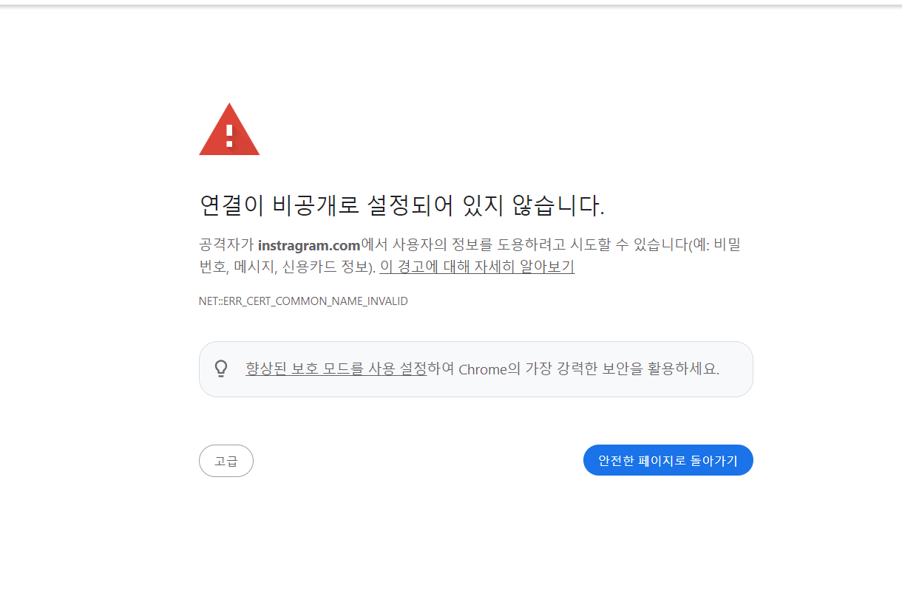

## install

- selenium

```python
 pip install selenium
```

- chromeDriver

```python
from selenium import webdriver
from selenium.webdriver.chrome.service import Service
from webdriver_manager.chrome import ChromeDriverManager

driver = webdriver.Chrome(service=Service(ChromeDriverManager().install())) # 드라이버 설치
```

## 파이썬 셀레니움을 통해서 인스타그램 해당 el찾기

```python
from selenium import webdriver
from selenium.webdriver.chrome.service import Service
from selenium.webdriver.common.by import By
from webdriver_manager.chrome import ChromeDriverManager
import time


driver = webdriver.Chrome(service=Service(ChromeDriverManager().install()))
driver.get('https://instragram.com') # 파이썬으로 해당 브라우저 열기

# 브라우저 유지
input("Press Enter to close the browser...")  # 엔터 키를 누를 때까지 브라우저 유지

time.sleep(2)  # 페이지 로딩 대기

# 방법 1: 전체 클래스명 사용
e = driver.find_element(By.CSS_SELECTOR, '.x1lliihq.xlp1vlek.xryxfnj.xln2onr6.x1j0vk5s.xl8bv5gf.xl93l95w.xeugll.x1fj9vlw.xl3faq.be.xlvvkbs.xls928wv.xhkezso.xlwr53x.xlgplm7.xarty.x1943hcx.xllbuxe.xw391rp.xv31lw6.x5n08af.x2buid.xltu3fi.x3x7a5m.xl0wh9bi.xladske.xbvl0k.xl8hxmj')

# 또는 방법 2: XPath 사용 (텍스트로 찾기)
e = driver.find_element(By.XPATH, "//*[contains(text(), '앱을 다운로드하세요')]")
print(e.text)
```

> 강의에서는 안다루지만, 위의 방법으로하면 안전하지못한 인터넷입니다.. 고급 누르고 그래도 접속하기 이런 메뉴가뜸(이미지참고)

 <br/>

- 내가 원하는 요소를 파이썬이 찾기도전에 위의 화면이 뜨니까 못찾아옴.
- 클로드한테 물어보니 다음과같은 방법을 명시해줬음

```python
from selenium import webdriver
from selenium.webdriver.chrome.service import Service
from selenium.webdriver.common.by import By
from selenium.webdriver.chrome.options import Options
from webdriver_manager.chrome import ChromeDriverManager

import time

# 크롬 옵션 설정
chrome_options = Options()
chrome_options.add_argument('--ignore-certificate-errors')
chrome_options.add_argument('--ignore-ssl-errors')
chrome_options.add_argument('--start-maximized')  # 창 최대화
chrome_options.add_argument('--disable-blink-features=AutomationControlled')  # 자동화 감지 방지

# 옵션 추가해서 드라이버 시작
driver = webdriver.Chrome(
    service=Service(ChromeDriverManager().install()),
    options=chrome_options
)


driver.get('https://instagram.com')

# 페이지 로딩 대기 시간을 좀 더 늘려보기
time.sleep(5)

try:
    element = driver.find_element(By.XPATH, "//*[contains(text(), '앱을 다운로드하세요')]")
    print("찾은 텍스트:", element.text)
except Exception as e:
    print("요소를 찾지 못했습니다:", e)

input("Press Enter to close the browser...")
```

> 참고로.. AI한테 "'로그인' 텍스트가 있는 버튼 찾는 XPath 보여줘" 등등을 시키면 `||*...` 이런식으로 잘 찾아내준다.
