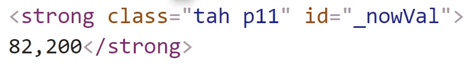

## install

> pip란? 라이브러리 설치할 때 쓰이는 도구<br/>

- 터미널에 install

`pip install requests` - 파이썬으로 웹사이트 접속 도와주는 라이브러리 <br/>
`pip install bs4` - 파이썬으로 HTML 웹문서 분석 도와주는 라이브러리

## 1. 파이썬으로 데이터 들어있는 웹 사이트 접속

### 파이썬으로 웹 접속하기

```python
# 파이썬으로 웹사이트 접속 도와주는 라이브러리
import requests

데이터 = requests.get('URL')

# 출력해주고싶으면 이렇게 가능
print(데이터) # <Response[200] > 이라고 출력되고,
print(데이터.content) # 이렇게해주면 그 사이트의 모든 HTML데이터를 보여줌
print(데이터.status_code) # 그 웹페이지 접속 제대로 되고 있나 확인 가능

```

- 하지만 위와 같이하면 한글은 깨져보임 이쁘게 html을 출력해주려면 아래처럼 해주면 됌 <br/>
  그러면 터미널에 HTML들이 잘 찍힘

```python
import requests
from bs4 import BeautifulSoup

데이터 = requests.get('https://finance.naver.com/item/sise.nhn?code=005930')

soup = BeautifulSoup(데이터.content , 'html.parser')
print(soup)
```

### HTML 속에서 필요한 정보만 뽑아내기

```python
import requests
from bs4 import BeautifulSoup

데이터 = requests.get('https://finance.naver.com/item/sise.nhn?code=005930')

soup = BeautifulSoup(데이터.content , 'html.parser')
print(soup.find_all('태그명',속성명))
```

예를들면, 아래와 같은 이미지의 태그가있다면<br/>

 <br/>

아래 코드처럼 입력해주면 된다.<br/>

> 참고로 이미지와 아래 주석 output의 값이 다른이유는 강의에서의 환경과 지금 내 환경이 달라서임

```python
# [] List 형태로 출력해줌
# output: [<strong class="tah p11" id="_nowVal">54,100</strong>]
print(soup.find_all('strong',id="_nowVal"))


# 그렇기때문에 [0]을 붙여서 원하는 값을 인덱싱해서 가져오면 됌
# output: <strong class="tah p11" id="_nowVal">54,100</strong>
print(soup.find_all('strong',id="_nowVal")[0])


# 54,100만 가져오고싶다면
# output: 54,100
print(soup.find_all('strong',i d="_nowVal")[0].text)
```

### class로 가져오기

```python
# class로 찾아오고싶으면 _를입력해야함
print(soup.find_all('span', class_='tah'))

# class로 찾아올 때 클래스명이 class=tah p11 두개라면, 하나만 쓰면 됌
print(soup.find_all('span', class_='tah'))

# class로 찾으면 중복된 class가 있을 수 있어서 그걸 모두 찾아옴
# 찾아온 자료를 적절하게 필터링해서 사용해야됌
```

### 좀 더 간단하게 class와 id 가져오기

> select : ccs 셀렉터 입력해서 원하는 HTML 찾기 가능

```python
import requests
from bs4 import BeautifulSoup

데이터 = requests.get('https://finance.naver.com/item/sise.nhn?code=005930')

soup = BeautifulSoup(데이터.content , 'html.parser')

# Before
print(soup.find_all('strong',id="_nowVal"))

# After
soup.select('strong#_nowVal')

# Before
print(soup.find_all('strong',id="_nowVal"))

# After
soup.select('#_nowVal') # 혹은 class는 . 붙여서
soup.select('.nowVal')

# 참고로 아무것도없이 붙이면 태그명을 뜻함
soup.select('strong')
```
