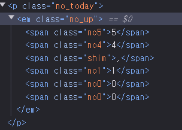
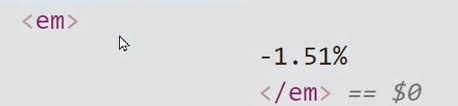

# 베이스코드

```python
import requests
from bs4 import BeautifulSoup

데이터 = requests.get('https://finance.naver.com/item/sise.nhn?code=005930')

soup = BeautifulSoup(데이터.content , 'html.parser')
```

## 글자가 해체 되어있는 경우



`no_up`을 찾고 인덱싱후 .text만 찍어주면 된다.

```python
print(soup.find_all('em',class_="no_up")[0].text)
```

## class, id가 하나도 없는 요소



### 방법 1

> em이라는 요소가 수백개가 나오지만 그중에서 인덱싱해서 찾는 노가다 방법

```python
print(soup.find_all('em')[0].text)
```

### 방법 2

> css 셀렉터 이용해서 찾기

상위 요소를 찾고, 그 안에있는 요소를 찾아달란 식의 코드 작성.

```python
soup.select('.f_down em') # class='f_down' 을 찾은뒤 그 안에있는<em>을 찾으라는 뜻
```

## 이미지 수집

```python
이미지 = soup.select('#img_chart_area')[0]
print(이미지['src'])
```

## 이미지 URL 알고있을 때 파일로 저장

```python
import urllib.request #import 모여있는 맨위에다가 작성

urllib.request.urlretrieve(이미지URL, '파일명') # 파일명은 임의로 작성 ex) 파일.jpg
```

실행하면 파이썬 파일이랑 나란한 곳에 저장됌
